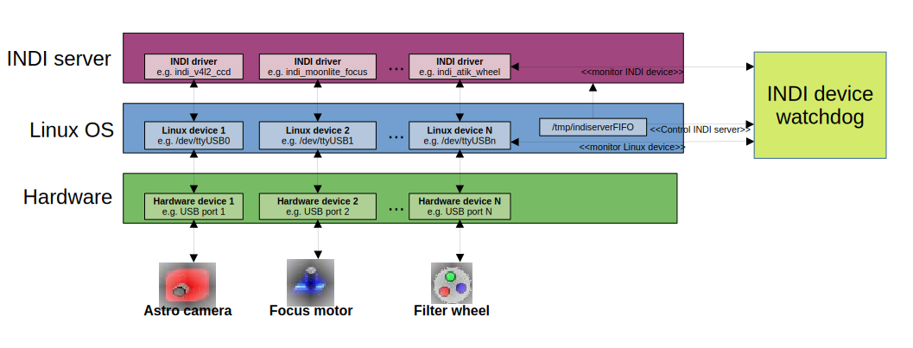

INDI Device Watchdog
====================

## Summary
This little software project is about...


## Motivation
In a perfect world you wouldn't need this piece of software. Unfortunately, the world is not always perfect - especially when it comes to IT. When using the INDI software in the field with my astro imaging hardware I ran into multiple unreliabilities which in the end made some imaging sessions fail and caused some frustation. The main reason: Unreliable USB connections mainly due to drained plugs.

Over the years, some of the USB ports on my astro equipment have become a little wonky and slightly unreliable. Still, replacing an entire astronomy camera because of that is way to expensive (at least for me). Loosing the connection (even just for a second) leads to a chain of events:

 1. It often took minutes to realize that a device had physically lost connection.
 2. The INDI driver did not realize the unavailability of the Linux device and thought it was still connected.
 3. Trying to disconnect the INDI driver made the driver not respond anymore or sometimes - if disconnecting worked -  reconnecting the INDI driver mostly failed.
 4. Some INDI drivers hung or crashed due to temporary unavailability of the Linux device (some drivers do not detect when a Linux devices disappears or do not handle this situation correctly)
 5. Physically reconnecting the device worked on the Linux level but on the INDI level it often did not (even after making sure that the Linux device is always the same after a physical reconnect).
 6. Often the only chance to solve this problem was to restart the INDI server (I later learned tat this is not always required - see section "Controlling the INDI server").

Restarting the INDI server in the middle of an imaging session typically ruins the entire image and I had to start all over again. Two of those fails could ruin an entire astro evening.


## Project vision
TODO...


## System overview
TODO...



## Further information
Please visit my blog https://www.lost-infinity.com for further details. The first article I published about this project can be found here: https://www.lost-infinity.com/indi-device-watchdog


## build

### Install required dependencies
The following libraries are required to build the INDI device watchdog on Ubuntu 20.04 LTS / Ubuntu 22.04 or Raspberry Pi OS.
For other Linux distributions the package names may slightly vary.

	sudo apt-get update
	sudo apt-get install zlib1g-dev libindi-dev libboost-dev \
	                     libboost-log-dev libboost-system-dev libboost-regex-dev \
	                     libboost-program-options-dev \
	                     libboost-test-dev clang-tidy

### Checkout repository

	git clone https://github.com/carsten0x51h/indi-device-watchdog.git

### Configure the build
To build from command line, simply do the following steps:

	cd indi-device-watchdog
	mkdir build
	cd build
	cmake ..

This will generate the build environment for your operating system. It will fail
if at least one dependency to an external library could not be resolved.


### Build the code
Run the following command to build the project: 

	cmake --build . -- all

or to build parallel on e.g. 12 cores, run

	cmake --build . -j12 -- all

### Create device configuration
To tell the INDI device watchdog which INDI devices and corresponding Linux devices it should monitor, a JSON configuration is used. An example of such file is shown below. In addition for each device the corresponding INDI driver name shall be specified to allow restart of this driver if necessary (unfortunately this information is currently not available from INDI under all given circumstances). Furthermore, for each entry the option if automatically connecting the INDI device is available. When enabled the INDI device watchdog tries to connect the respective INDI device. 

```
{
    "indiDevices": [
        {
            "indiDeviceName": "Joystick",
            "linuxDeviceName": "\/dev\/input\/js0",
            "indiDeviceDriverName": "indi_joystick",
            "enableAutoConnect": "true"
        },
        {
            "indiDeviceName": "V4L2 CCD",
            "linuxDeviceName": "\/dev\/video1",
            "indiDeviceDriverName": "indi_v4l2_ccd",
            "enableAutoConnect": "true"
        },
        {
            "indiDeviceName": "MoonLite",
            "linuxDeviceName": "\/dev\/serial\/by-id\/usb-FTDI_FT232R_USB_UART_A400rRDV-if00-port0",
            "indiDeviceDriverName": "indi_moonlite_focus",
            "enableAutoConnect": "true"
        },
        {
            "indiDeviceName": "Atik EFW2",
            "linuxDeviceName": "\/dev\/hidraw81",
            "indiDeviceDriverName": "indi_atik_wheel",
            "enableAutoConnect": "true"
        },
        {
            "indiDeviceName": "EQMod Mount",
            "linuxDeviceName": "\/dev\/serial\/by-id\/usb-FTDI_FT232R_USB_UART_A600ztuh-if00-port0",
            "indiDeviceDriverName": "indi_eqmod_telescope",
            "enableAutoConnect": "false"
        }
    ]
}
```

### Controlling the INDI server
TODO: Describe creation of INDI server pipe /tmp/indiserverFIFO....
...

To achieve that two simple steps are required.

1. Create a pipe - e.g. in the /tmp folder:

```
sudo mkfifo /tmp/indiserverFIFO
sudo chmod 664 /tmp/indiserverFIFO
```

2. Start the INDI server with the -f option passing the name of the pipe which you hust created. 

```
sudo indiserver -f /tmp/indiserverFIFO <Your INDI drivers>
```

To send commands to the INDI server you can now simply write to the pipe. For example to stop and start the "indi_v4l2_ccd" INDI driver without restarting the entire INDI server, the following commands can be used:

```
sudo echo "stop indi_v4l2_ccd" > /tmp/indiserverFIFO
sudo echo "start indi_v4l2_ccd" > /tmp/indiserverFIFO
```

The INDI device watchdog makes use of this mechanism to restart an INDI driver in case the corresponding Linux device exists but the INDI device does not.


### Run the INDI device watchdog
To run the INDI device watchdog the first time simply execute the following command to get an overview of the options:

```
./indi_device_watchdog --help
INDI device watchdog options:
  -h [ --help ]                         Display this parameter overview
  -H [ --hostname ] arg (=localhost)    Set hostname of INDI server
  -p [ --port ] arg (=7624)             Port of INDI server.
  -T [ --timeout ] arg (=3)             Timeout in seconds.
  -B [ --indi-bin ] arg (=/usr/bin)     Search path for INDI binaries.
  -P [ --indi-server-pipe ] arg (=/tmp/indiserverFIFO)
                                        Pipe which should be used to write 
                                        commands to the INDI server.
  -D [ --device-config ] arg            Config file with devices to monitor.
  -v [ --verbose ] arg                  Print more verbose messages at each 
                                        additional verbosity level.	

```


Example: ... Defaults... INDI server runs on port 7624 on localhost.... Location of INDI driver binaries are in /usr/bin 

	sudo ./indi_device_watchdog -D my-indi-device-config.json


